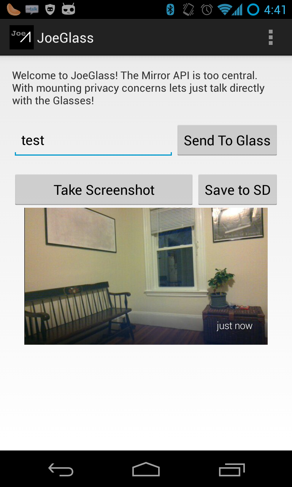
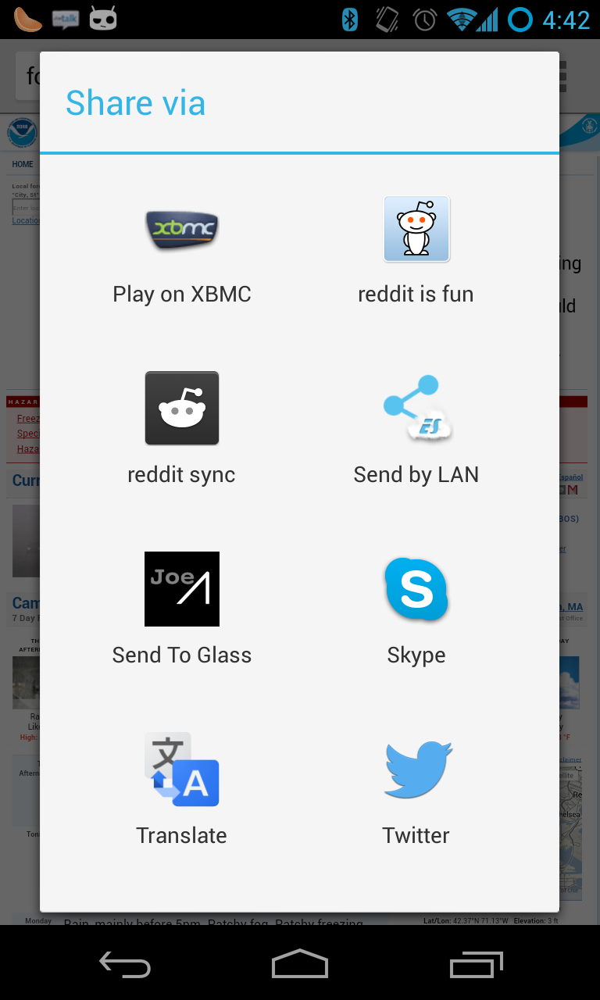

JoeGlass
===========

This app is for Google Glasses.  The Mirror API is too central. With mounting privacy concerns lets just talk directly with the Glasses!

This app is the start of a replacement for Google's MyGlass app. Nothing special needs to be installed on your glass. This app talks directly over Bluetooth to your glasses.  

You can send messages, take screenshots, and get device information.

I have added a "Send to Glass" option when sharing content on your phone so it can be sent directly to glass.

Source code: https://github.com/ieee8023/JoeGlass

Support my coding: http://josephpcohen.com/give/

